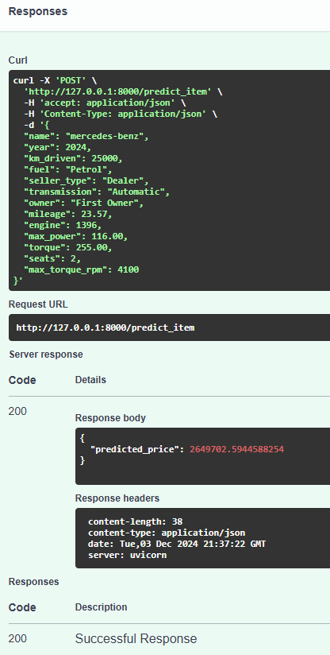

# About the project ***`API_regression_with_inference`***

[](https://github.com/nikfilonenko/API_regression_with_inference/actions/workflows/api_ridge_regression.yml)

## Ноутбук с EDA/Model: [Здесь](src/ml/notebooks/regression_with_inference_pro.ipynb)

`src/ml/notebooks/regression_with_inference_pro.ipynb`

### Содержание

1. [Описание проекта](#01)
2. [EDA](#02)
3. [Обучение моделей](#03)
   - [Модели регрессии](#031)
   - [Feature engineering](#032)
   - [Метрики](#033)
4. [Разработка веб-сервиса на FastAPI](#04)
5. [Демонстрация работы сервиса `API + Ridge regression model`](#05)

### Описание проекта <a name="01"></a>

**Цель данного проекта — разработка и развертывание модели регрессии для предсказания стоимости автомобилей на основе предоставленных признаков (для одного объекта/нескольких).**

Итоговое решение включает:

- EDA (анализ данных, их препроцессинг)
- Feature engineering
- Обучение моделей (эксперименты с `линейной регрессией`, `Lasso регрессией`, `Регрессией с L0 регуляризацией`, `Ridge регрессией` и `ElasticNet регрессией`)
- Разработка веб-сервиса на FastAPI


-----

### EDA <a name="02"></a>

- Выполнен детальный анализ данных:
	- выявление пропусков, дубликатов, выбросов
	- построены описательные статистики по числовым стобцам для трейна и теста
	- построены основные статистики по категориальным столбцам для трейна и теста
- Построен дашборд с помощью `ydata_profiling`:


- Изучены распределения признаков, влияющих на цену автомобиля (например, год выпуска, пробег, тип топлива и тд) с использованием гистограммы, box-plot, scatter-plot:


- Выполнен препроцессинг данных:
  - для корректной работы модели были обработаны пропущенные значения, выбросы и категориальные признаки (для числовых признаков были заменены медианой, для категориальных — модой)
  - использован `One-Hot Encoding` для кодирования категориальных признаков
  - признаки были стандартизированы с помощью `StandardScaler` для моделей, чувствительных к масштабу (например, `Ridge`, `Lasso`)

-----

### Обучение моделей <a name="03"></a>

#### Модели регрессии<a name="031"></a>

- Модели регрессии (обычная, Ridge, Lasso, ElasticNet) были обучены на стандартизированных данных, с использованием кросс-валидации для выбора оптимальных гиперпараметров

- Проведены эксперименты с различными типами регуляризации:
  - **Линейная регрессия**: базовая модель для сравнения.
  - **Ridge регрессия**: использована для борьбы с мультиколлинеарностью и переобучением, которая показала наилучший результат по метрикам качества (после feature engineering`а).
  - **Lasso регрессия**: позволила выбрать только важные признаки за счет L1 регуляризации, что повысило интерпретируемость модели.
  - **ElasticNet**: комбинация L1 и L2 регуляризаций.
  - **Регрессия с L0 регуляризацией**: для оценки важности отдельных признаков и снижения избыточности модели.

#### Feature engineering <a name="032"></a>
Также в качестве эксперимента был выполнен feature engineering, который, в последствие, значительно повлиял на качество обучения модели Ridge регрессии:
- были сгенерированы признаки на основе уже существующих (feature generation)
  - `horses_per_liter` - число "лошадей" на литр
  - `year_squared` - квадрат year автомобиля (поскольку зависимость цены от года выглядит квадратичной, а не линейной; значит, квадрат года явно принесет больше пользы)
- были созданы несколько новых признаков:
  - `is_third_or_more_owner` - бинарный признак, который будет принимать значение (1, если владелец третий или больше. 0, если владелец первый или второй)
  - `is_trustworthy_seller` - бинарный признак, который будет принимать значение (первый или второй владелец + продавец — официальный дилер)
- были обработаны выбросы у train-выборки методом Тьюки с использованием межквартильного диапазона:
  -  за выбросы будем считать все значения, находящиеся ниже `Q1 - 1.5 * IQR` или выше `Q3 + 1.5 * IQR`, где `Q1` и `Q3` - первый и третий квартили соответственно
- отлогарифмирована целевая переменная, посколько ее распределение было сильно скошено:

`selling_price` **ДО**:


`selling_price` **ПОСЛЕ**:


#### Метрики <a name="033"></a>

- Модели были оценены по метрикам MSE (среднеквадратичная ошибка) и RMSE (корень из средней квадратичной ошибки) и R2 (коэффициент детерминации).


**Пример полученных метрик лучшей модели:**

```python
    MSE Train: 25809476579.425
    RMSE Train: 160653.281
    R2 Train: 0.906

    MSE Test: 43322686123.913
    RMSE Test: 208141.025
    R2 Test: 0.925
```

**Также была выполнена оценка моделей на двух кастомных бизнес-метриках**

- Пример оценки с использованием бизнес-метрики, которая учитывает `under-prediction` и `over-prediction`


- Оценка всех, ранее обученных моделей регрессии по данной метрике:

```python
model_0:
Train business_metrics: 248834.839
Test business_metrics: 339585.513
-------------------------------------------------------

model_1:
Train business_metrics: 248834.839
Test business_metrics: 339585.513
-------------------------------------------------------

model_2:
Train business_metrics: 248834.067
Test business_metrics: 339584.401
-------------------------------------------------------

model_3:
Train business_metrics: 242624.101
Test business_metrics: 334964.304
-------------------------------------------------------

model_4:
Train business_metrics: 238214.203
Test business_metrics: 334507.211
-------------------------------------------------------

model_5:
Train business_metrics: 248834.839
Test business_metrics: 339585.513
-------------------------------------------------------

model_6:
Train business_metrics: 185687.153
Test business_metrics: 232517.882
-------------------------------------------------------

best_ridge_model_final:
Train business_metrics: 133610.225
Test business_metrics: 169833.728
-------------------------------------------------------
```

`best_ridge_model_final` (Ridge регрессия обученная на новых признаков после Feature engineering`а) показала значительно лучшие результаты как на тренировочной выборке, так и на тестовой.

**На основе данной метрики можно утверждать, что `best_ridge_model_final` наиболее соответствует бизнес-требованиям**

-----

### Разработка веб-сервиса на FastAPI <a name="04"></a>

- Создан класс Settings, который хранит название и версию проекта `src/api/core/config.py`

- С использованием библиотеки Pydantic созданы модели Car и Cars `src/api/core/models.py`
  - Car описывает данные об одном объекте 
  - Cars коллекцию объектов

- Созданы функции save_predictions и is_csv `src/api/core/utils.py`
  - save_predictions реализует сохранение предсказаний в CSV-файл
  - is_csv - проверку, является ли загруженный файл корректным CSV

- Созданы роутеры: `src/api/routers/predictions.py`
  - predict_item - для предсказания цены одного автомобиля
  - predict_items - для предсказания цен множества автомобилей, загружаемых через CSV файл

- Сервисы: `src/api/services/model_logic.py`
  - Веса, ранее обученной модели и необходимые объекты (скейлер, кодировщик One-Hot Encoding) загружаются из файла best_model.pkl
  - Функции ohe_encoding_data и std_scale выполняют предварительную обработку данных (кодирование категориальных признаков и стандартизацию числовых)
  - В функции preprocess_data выполняются дополнительные трансформации признаков (например, вычисление мощности на литр объема двигателя и другие)
  - Функция make_single_prediction выполняет предсказание для одного автомобиля
  - Функция make_bulk_prediction обрабатывает файл CSV, предсказывая цену для каждого автомобиля в файле.

-----
## Демонстрация работы `API + Ridge regression model` <a name="05"></a>

- **Swagger UI документация для сервиса Car Price Predictor на базе FastAPI**


- **Эндпоинты:**
  - **POST** `/predict_item` — используется для предсказания стоимости машины по переданным признакам одного объекта
  - **POST** `/predict_items` — используется для предсказания стоимости нескольких машин по признакам из загруженного CSV-файла
  - **GET** `/` — корневой маршрут

### Предсказание одного объекта

- **Пример работы сервиса `№1`:**


- **Пример работы сервиса `№2`:**



### Предсказание нескольких объектов, на основе переданных признаков в csv-файле

- **Пример работы сервиса:**


